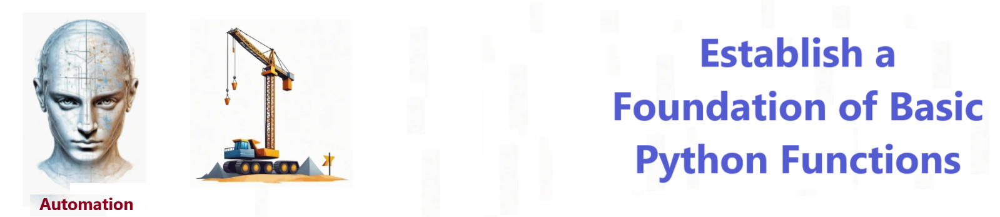

# Python Basic Foundation - Create sample Python Functions  

## Description

Python Basic Foundation - Create sample Python Functions  

## Features

- has over 10 building blocks
- read and write files
- perform math
- build functions

## Getting Started

To get started with the **Python Basic Foundation** project, follow these steps:

1. Clone the repository to your local machine.
2. Install the required dependencies listed at the top of the notebook.
3. Explore the example code provided in the repository and experiment.
4. Run the notebook to hear your code come to life!

 

